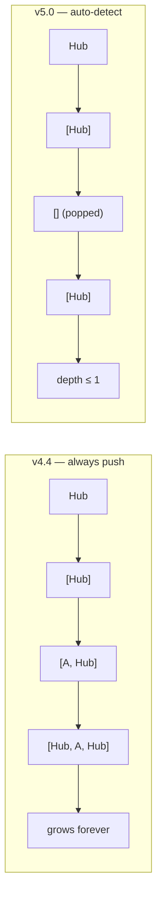
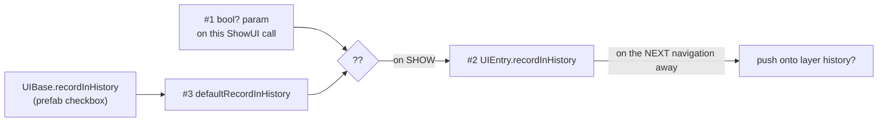

# OhmUISystem — Navigation API Explanation

A focused explanation of how `UIManager` decides what goes on a layer's back history, and of the
optional flags on `ShowUI(…)` — **`recordInHistory`**, **`showInstant`**, and
**`hideCurrentInstant`**.

For the full API surface see [Technical_Documentation.md](Technical_Documentation.md); for the
end-user guide see [OhmUISystem_README.md](OhmUISystem_README.md).

> **v5.0** removed the `isBackwards` parameter. Back steps are now **detected automatically**.
> See [§3](#3-why-auto-detect-replaced-isbackwards) for the reasoning and
> [Technical_Documentation.md §8](Technical_Documentation.md#8-migration) for migration.

---

## 1. The `ShowUI` family at a glance

```csharp
UIBase ShowUI<T>(bool? recordInHistory = null, bool showInstant = false, bool hideCurrentInstant = false)
UIBase ShowUI(Type toUI, bool? recordInHistory = null, bool showInstant = false, bool hideCurrentInstant = false)
UIBase ShowUI<TData>(Type toUI, TData data, bool? recordInHistory = null, …)
UIBase ShowUI<TUI, TData>(TData data, bool? recordInHistory = null, …)
```

All of them funnel into one private core where the history logic lives. There is **no prefab-based
overload** — pass a `Type` (`UIType.UIShop`, `typeof(UIShop)`, or `prefab.GetType()`).

| Flag | Controls |
|---|---|
| `recordInHistory` | Whether the UI being shown is recorded when something later replaces it |
| `showInstant` | Skips the incoming UI's Show transition |
| `hideCurrentInstant` | Skips the transition for everything this call dismisses |

---

## 2. How the history stack is decided

The entire rule is these 14 lines in the private `ShowUI` core:

```csharp
// --- History Management ---
// A show that lands on the layer's history top is a back step: consume the breadcrumb
// instead of pushing. Otherwise record the outgoing UI (unless it opted out).
var history = historyPerLayer[targetLayer];
if (history.Count > 0 && history.Peek() == toUI)
{
    history.Pop();
}
else if (currentOnTarget != null && currentOnTarget != toUI)
{
    // A UI shown with recordInHistory off is never pushed — the history system skips it.
    var currentEntry = GetEntry(currentOnTarget);
    if (currentEntry == null || currentEntry.recordInHistory)
        history.Push(currentOnTarget);
}
```

| Situation | Effect |
|---|---|
| Target **is** the layer's history top | **Pop** — treated as a back step |
| Target is not the top, and there is an outgoing UI that records | **Push** the outgoing UI |
| Target is not the top, outgoing UI has `recordInHistory == false` | Nothing |
| No outgoing UI on that layer (layer was empty) | Nothing |

`ShowPreviousUI()` needs no special flag: it targets `stack.Peek()`, so the first branch always
fires.

---

## 3. Why auto-detect replaced `isBackwards`

`isBackwards` was an explicit "pop, don't push" flag. Two facts made it dead weight:

- It had **one** live caller in the entire codebase — `ShowPreviousUI`. Nothing else could reach
  it: every other call site navigated forward via `ShowUI(target)`.
- The two models diverge **only** when the target is already the history top. In any cycle of
  length ≥ 3 (`A→B→C→A`) the top is `B`, not `A`, so push behavior is identical. The change is
  confined to immediate 2-cycles — where "unwind" is the desired answer anyway.

And explicit forward-only navigation caused two real defects that auto-detect fixes:

**(a) Hub-and-spoke grew without bound.** With graph-authored `ChangeUI` links,
`Hub → A → Hub → B → Hub`:



**(b) A stale self-referential entry.** Combining `recordInHistory: false` with a forward return:

```
Main shown                                   S=[]        cur=Main
ShowUI<UIPopup>(recordInHistory: false)      push Main   S=[Main]   cur=Popup
ShowUI<UIMain>()   ← forward "close" link    Popup skipped, no push
                                             S=[Main]    cur=Main   ⚠
```

`CurrentUI == PreviousUI`, so `GetHistoryCount` reported 1 and a Back button looked live but did
nothing visible. Auto-detect pops instead, leaving `S=[]`.

**Trade-off accepted:** you can no longer suppress a push at *leave* time. `recordInHistory` decides
at *enter* time, so a transition that only becomes "don't record me" later cannot be expressed.
Nothing in the system used this.

---

## 4. `recordInHistory` — three things with the same name

| # | Where | Type | What it is |
|---|---|---|---|
| 1 | The `ShowUI(…)` overloads | `bool?` | **Per-call override.** `null` = "use the prefab's setting" |
| 2 | `UIEntry.recordInHistory` (nested in `UIManager`) | `bool` field | **Mutable runtime state.** The resolved answer for the most recent show of that UI |
| 3 | `UIEntry.defaultRecordInHistory` | `bool` computed | **Read-only prefab default**, proxying `UIBase.RecordInHistory` (serialized, defaults `true`) |

They meet at exactly one line:

```csharp
// Per-call override wins; otherwise the prefab's Record In History setting applies.
toEntry.recordInHistory = recordInHistory ?? toEntry.defaultRecordInHistory;
//   ^ #2 (state)          ^ #1 (param)        ^ #3 (prefab default)
```

`#3` is the designer-facing end: the **Record In History** checkbox on `UIBase`.

---

## 5. Write now, read later

The parameter is about the UI you're **showing**, but the value is only *consumed* when that UI later
becomes the one you're **leaving**:

```csharp
var currentEntry = GetEntry(currentOnTarget);   // the OUTGOING UI
if (currentEntry == null || currentEntry.recordInHistory)
    history.Push(currentOnTarget);
```

The read (history block) runs **before** the write. So a single call reads the *outgoing* entry's
value — stashed by that UI's own earlier show — then writes the *incoming* entry's value for next
time.



**This is the single most common source of confusion.** `ShowUI(X, recordInHistory: false)` does
**not** mean "don't record this navigation" — the outgoing UI is still pushed by its own flag. It
means "don't record **X** when something later replaces X."

---

## 6. `recordInHistory` is same-layer only

History is strictly per layer. The flag is read *inside* the `targetLayer` history block, so a
cross-layer show never consults it:

| Step 2 target relative to the current UI | Is the current UI's `recordInHistory` read? | Effect |
|---|---|---|
| Same layer | **Yes** | Skipped or pushed as configured |
| Higher layer | No | Current UI stays current *and visible* underneath |
| Lower layer | No | Current UI is force-hidden by the "clear layers above" pass |

A consequence worth internalizing: **when a layer's stack is empty, `OnEscape` does not pop — it
calls `CloseLayerInternal` and closes the whole layer.** That is why a popup chain with no recorded
entries "falls through" to whatever sits on the layer below.

### Worked example — the pause-menu chain

`UIGameplay` is on layer Main; `UIPauseMenu` and `UISettings` are both on layer **Popup**.

Ticking **Record In History** off on `UIPauseMenu` looks right ("don't come back to the pause
menu") but produces the wrong result:

| Call | `S_Popup` | Why |
|---|---|---|
| `ShowUI(UIType.UIPauseMenu, recordInHistory: false)` | `[]` | Popup layer was empty — nothing to push |
| `ShowUI(UIType.UISettings)` | `[]` | outgoing PauseMenu has `record == false` → **push skipped** |
| `OnEscape()` | — | stack empty → **layer closes** → lands on Gameplay, not PauseMenu |

The flag belongs on `UISettings` instead:

| Call | `S_Popup` | Escape lands on |
|---|---|---|
| `ShowUI(UIType.UIPauseMenu)` | `[]` | — |
| `ShowUI(UIType.UISettings)` | `[PauseMenu]` | **PauseMenu** |
| `ShowUI(UIType.UIAudioSettings)` | `[PauseMenu]` — Settings opts out | **PauseMenu** (directly) |
| `OnEscape()` from PauseMenu | `[]` → layer close | **Gameplay** |

Rule of thumb: tick the flag off on the screens you want back navigation to **skip over**, not on the
screen you want to **return to**.

---

## 7. Instant transitions

`UIBase.Show(bool instant)` / `Hide(bool instant)` bypass the `TransitionController` tween. v5.0
plumbs that through the manager.

```csharp
// Show gets two independent flags
ShowUI<T>(bool? recordInHistory = null, bool showInstant = false, bool hideCurrentInstant = false)
ShowPreviousUI(bool showInstant = false, bool hideCurrentInstant = false)

// Close-only APIs get one — there is only one thing going away
CloseUI<T>(bool instant = false)
CloseUI(Type, bool instant = false)
CloseUI(UIBase, bool instant = false)
CloseLayer(UILayer, bool instant = false)
CloseAllUI(bool instant = false)
OnEscape(bool instant = false)        // forwards to BOTH show and hide
```

`hideCurrentInstant` covers **everything the call dismisses** — the outgoing UI on the target layer
*and* every UI torn down by the "clear all layers above target" pass.

```csharp
ShowUI<UISettings>(showInstant: true);          // incoming cuts in, outgoing still animates out
ShowUI<UISettings>(hideCurrentInstant: true);   // outgoing cuts, incoming fades in
ShowUI<UISettings>(showInstant: true, hideCurrentInstant: true);  // hard cut both ways
CloseAllUI(instant: true);                      // everything gone in one frame
```

**Not affected:** a timed UI expiring via `ShowUIForDuration` always animates out — its auto-hide
routine calls `Hide()` with no flag on purpose.

---

## 8. Code recipes

```csharp
// Forward — normal navigation.
UIManager.Instance.ShowUI<UISettings>();
UIManager.Instance.ShowUI(UIType.UISettings);          // Type constant

// Backward — walks the topmost layer's history, no-op when empty.
UIManager.Instance.ShowPreviousUI();
UIManager.Instance.ShowPreviousUI(UILayer.Main);       // a specific layer

// Back to a *specific* UI — if it is the layer's history top, this pops
// automatically; no flag needed.
UIManager.Instance.ShowUI<UIMainMenu>();

// A UI the back chain should skip over.
UIManager.Instance.ShowUI<UISettings>(recordInHistory: false);

// Force-record a UI whose prefab has Record In History unticked.
UIManager.Instance.ShowUI<UISettings>(recordInHistory: true);

// With a data payload — two shapes, pick by whether the target is known at compile time.
UIManager.Instance.ShowUI<UIShop, ShopData>(shopData);            // compile-time checked
UIManager.Instance.ShowUI<ShopData>(UIType.UIShop, shopData);     // runtime/dynamic Type

// Instant.
UIManager.Instance.ShowUI<UISettings>(showInstant: true, hideCurrentInstant: true);
UIManager.Instance.OnEscape(instant: true);
```

**Pass the flags by name.** The data-injecting overloads shift their position, so a bare `true` in
the wrong argument slot is a silent behavior change rather than a compile error.

---

## 9. Gotchas

- **`recordInHistory: false` does not suppress the current push.** It is read on the *next*
  navigation away from the UI you just showed (§5).
- **`recordInHistory` is same-layer only** (§6). Ticking it off on a UI whose "parent" lives on a
  lower layer does nothing — that layer's stack was never involved.
- **An empty layer stack means `OnEscape` closes the layer**, it does not pop (§6).
- **`#2` is per-prefab-type, not per-instance** — one `UIEntry` per registered prefab.
- **It is re-resolved on every managed show**, so a one-off `recordInHistory: false` doesn't stick:
  the next `ShowUI` with `null` snaps back to the prefab default.
- **Detached and timed UIs bypass all of this.** `ShowUIForDuration` and any prefab with `detached`
  ticked return before the history block, so neither `recordInHistory` nor `hideCurrentInstant`
  applies. `showInstant` still reaches the detached instance's `Show`.
- **`OnEscape` with an explicit `backTo`** clears the layer stack and navigates forward — it does not
  pop. Only the `isBackToPreviousUI` branch walks history.
- **Layers above the target are always cleared**, including on a back step.
